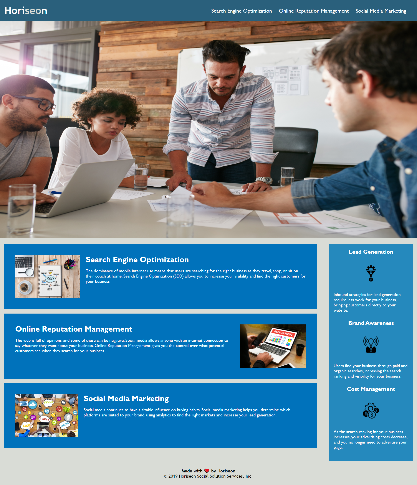

# 01_accessibilityhmwrk

# Horiseon Website Mock-Up

## Project Goal

Horiseon approached us with the goal in mind to refactor their website in order to meet certain standards.

The ADA, also known as the Americans with Disabilities Act, requires companies to abide by certain laws in order to help prevent discrimination against those with disabilities. Horiseon strives to be WCAG compliant, thus increasing the accessibility of their website was our goal.

Accessibility ensures that people with disabilities can access a website using assistive technologies like video captions, screen readers, and braille keyboards.

Along with accessibility, we also have some acceptance criteria listed below that Horiseon wishes to have done.

In conclusion, I learned that there is much HTML/CSS code that is required in order to make a website more accessible. It is something that is often overlooked and not thought about by those who don't have hearing/vision impairments.

## User Story

```
AS A marketing agency
I WANT a codebase that follows accessibility standards
SO THAT our own site is optimized for search engines
```

## Acceptance Criteria

```
GIVEN a webpage meets accessibility standards
WHEN I view the source code
THEN I find semantic HTML elements
WHEN I view the structure of the HTML elements
THEN I find that the elements follow a logical structure independent of styling and positioning
WHEN I view the image elements
THEN I find accessible alt attributes
WHEN I view the heading attributes
THEN they fall in sequential order
WHEN I view the title element
THEN I find a concise, descriptive title
```

## Table of Contents

If your README is long, add a table of contents to make it easy for users to find what they need.

- [Links to Application](#Links)
- [Mock-Up](#Mock-Up)
- [Credits](#credits)
- [License](#license)

## Links

Below are links to access this live website and repository.

Github: bergannation
/
01_accessibilityhmwrk

Deployed URL: https://bergannation.github.io/01_accessibilityhmwrk/

## Website Mock-Up

The following image shows the web application's appearance and functionality:



## Credits

Nic Brown
https://github.com/brownnicholasj

ADA Checklist guidelines:
https://medium.com/@krisrivenburgh/the-ada-checklist-website-compliance-guidelines-for-2019-in-plain-english-123c1d58fad9
